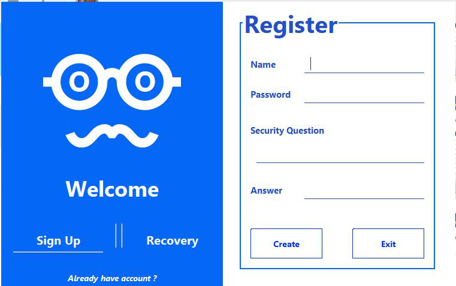
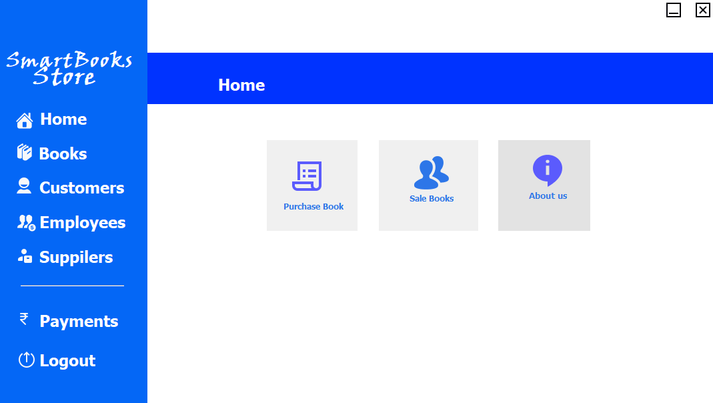
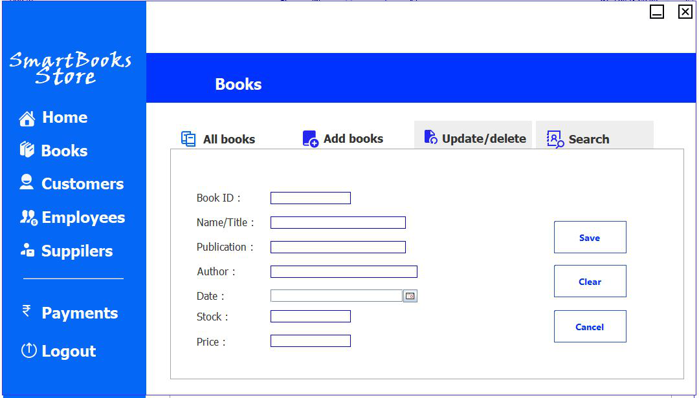
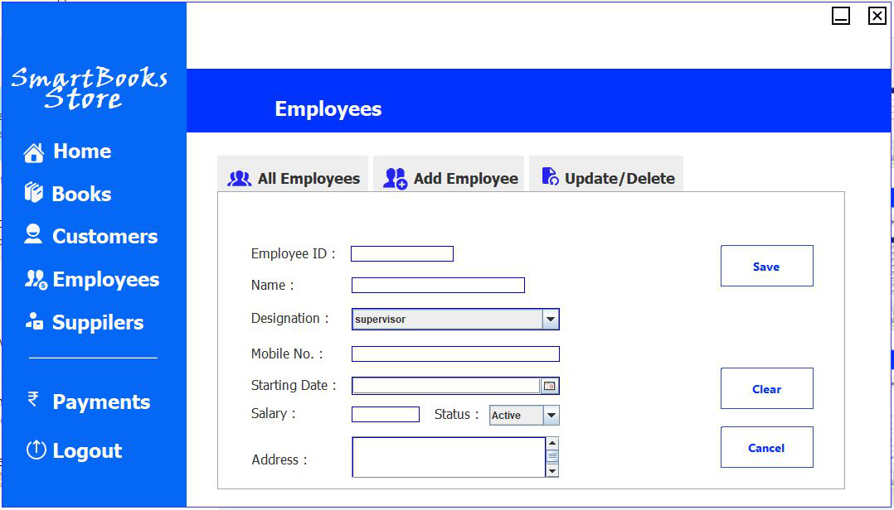
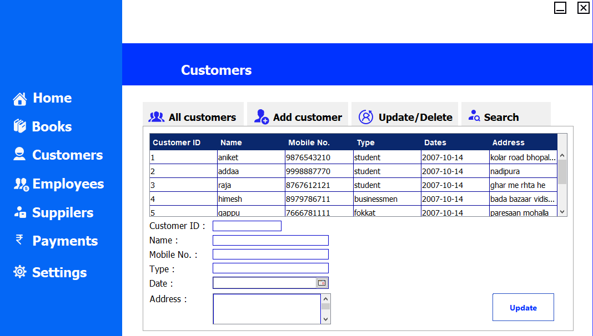
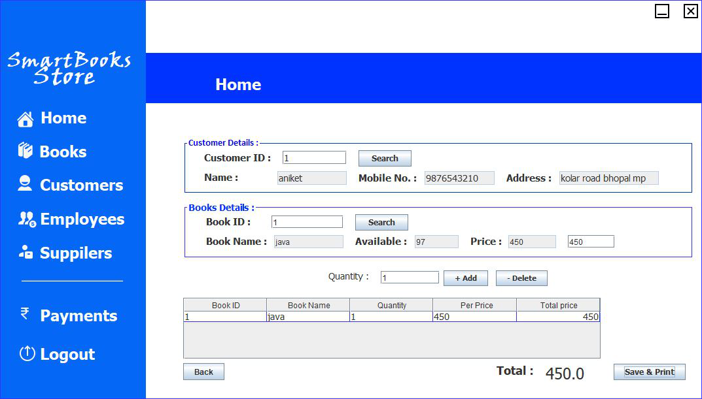
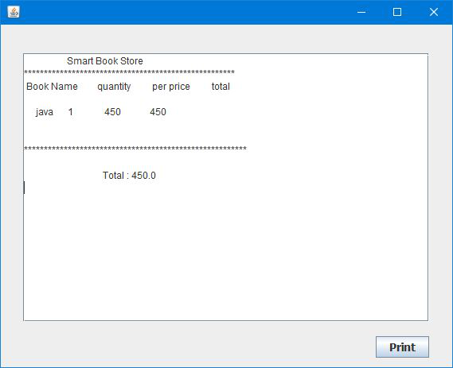

# Smart-Book-Store
<b>Splash Screen</b>

<b>login page</b>

<b>Register page</b>

<b>Recovery page</b>

<b>Home Screen</b>

<b>Book Search</b>

<b>Add Book</b>

<b>Update Book</b>

<b>Update Customer</b>

<b>Sale Book</b>

<b>Bill Generator</b>

