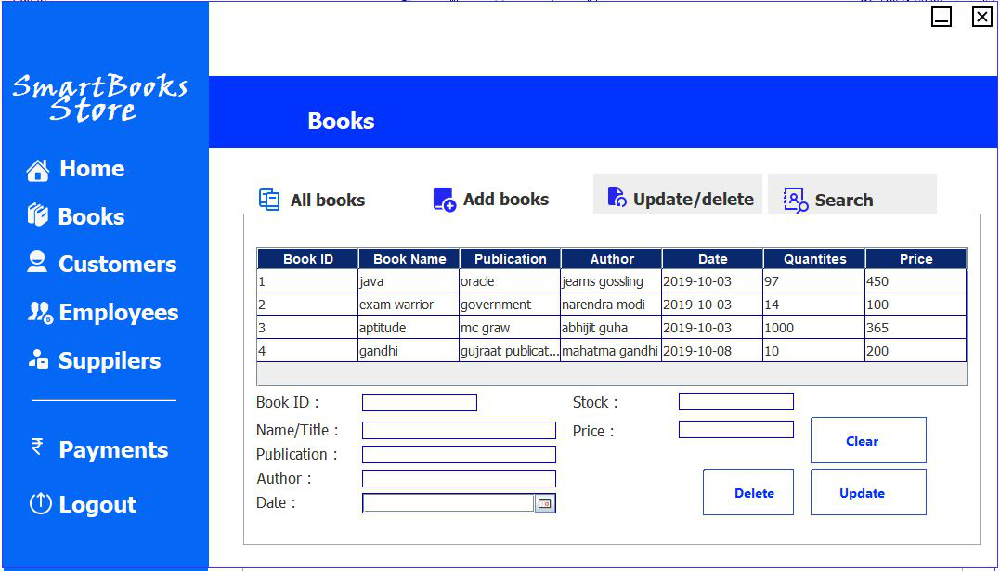
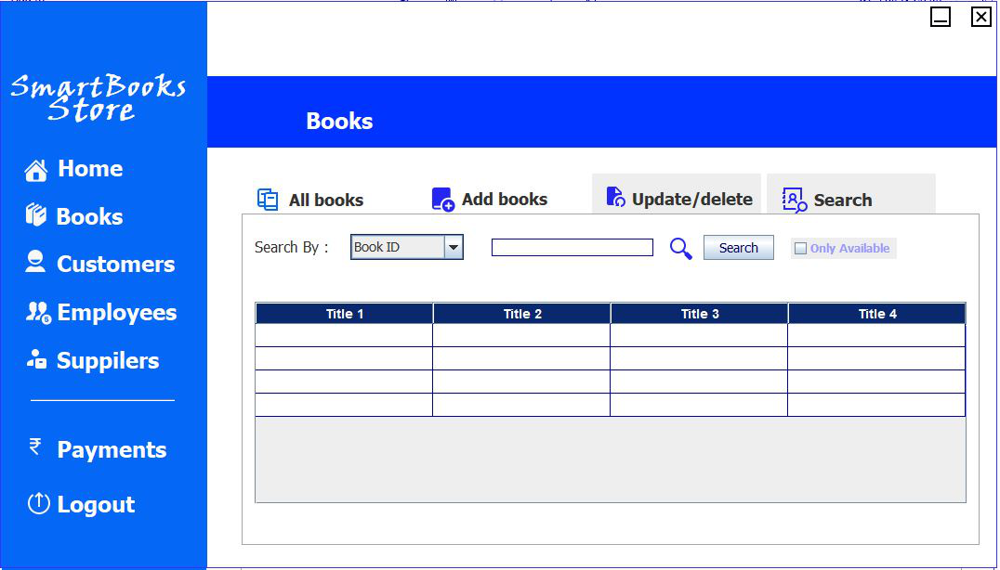
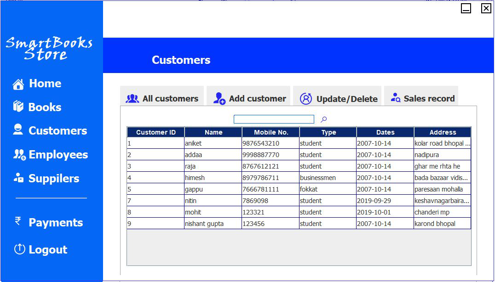
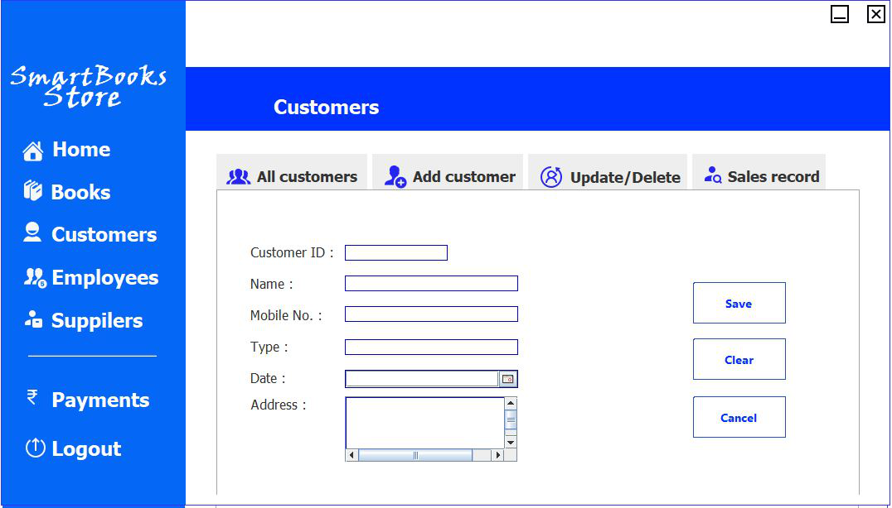
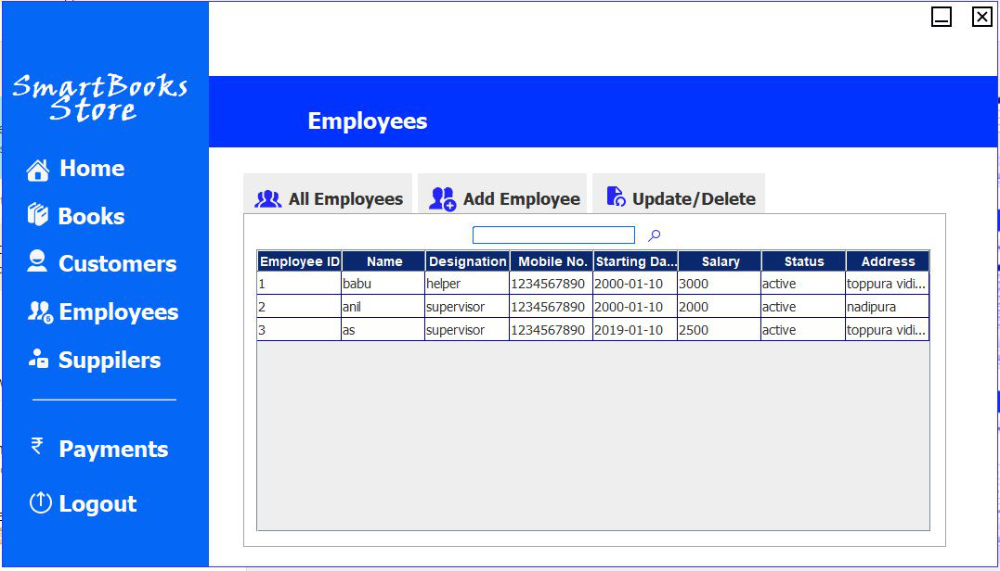
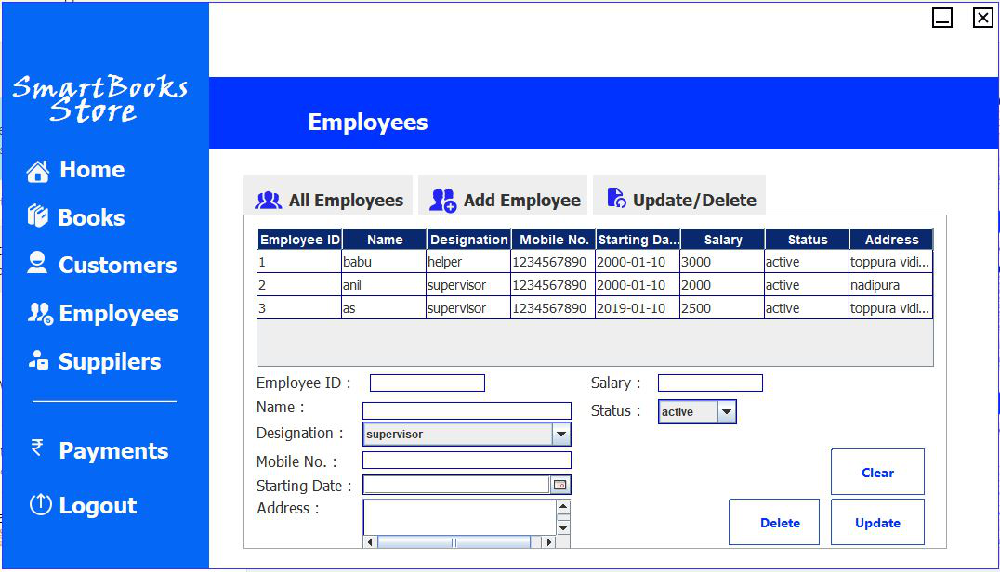
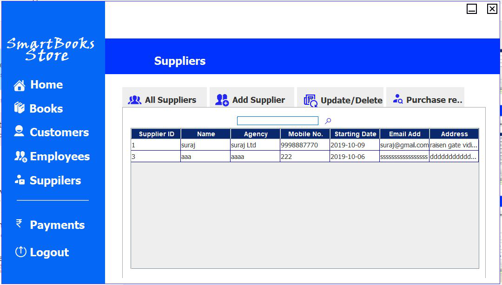
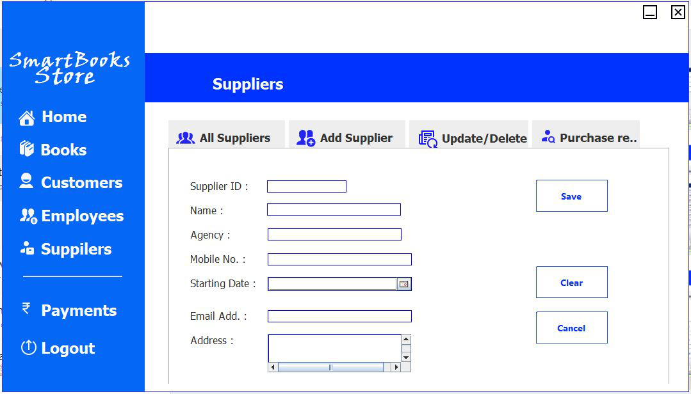
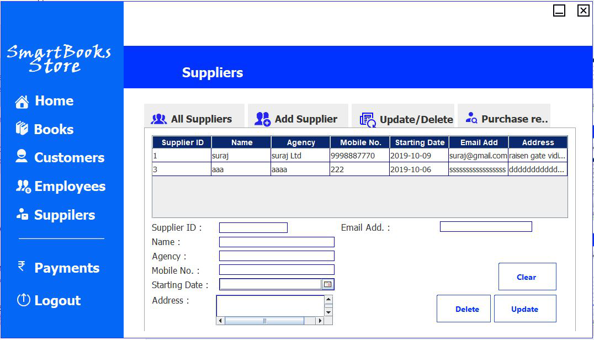
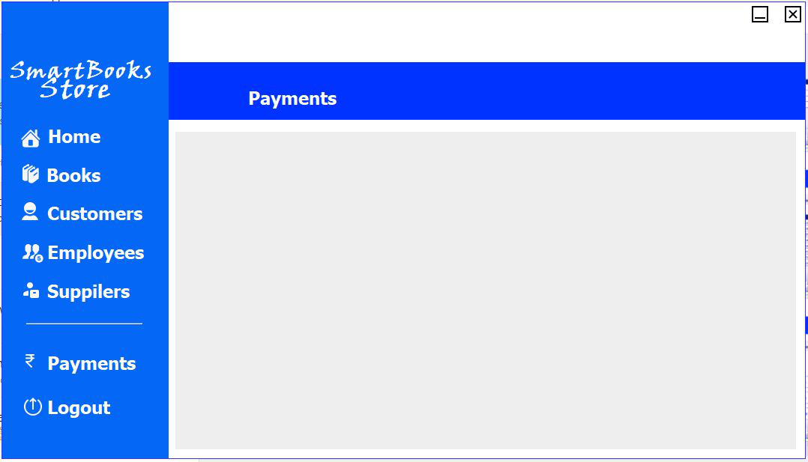

# Smart-Book-Store

<h2>Splash-Screen</h2>

<h2>login page</h2>

<h2>Register page</h2>

<h2>Recovery page</h2>

<h2>Home Screen</h2>

<h2>Filter Book </h2>

<h2>Add Book</h2>

<h2>Update Book</h2>

<h2>Search Book</h2>

<h2>Search Customer</h2>

<h2>Add Customer</h2>

<h2>Update Customer</h2>

<h2>Search Employees</h2>

<h2>Add Employees</h2>

<h2>Update Employees</h2>

<h2>Search Supplier</h2>

<h2>Add Supplier</h2>

<h2>Update Supplier</h2>

<h2>Payments</h2>

<h2>Sale Book</h2>

<h2>Bill Generator</h2>

